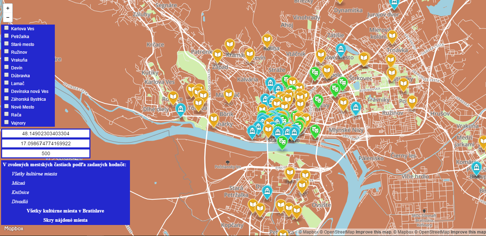

*Dokumentácia semestrálneho projektu z PDT*
*Akademický rok 2016/2017, zimný semester*
*Autor - Miloš Pallo*

# Prehľad projektu

Systém predstavuje mapovú aplikáciu, ktorá umožňuje zobraziť kultúrne zariadenia v Bratislave, konkrétne divadlá, múzeá a knižnice, pomocou značiek zobrazených na mape. Funkcie aplikácie sú nasledovné:
- zobraziť všetky kultúrne miesta v Bratislave
- zobraziť všetky kultúrne miesta v zvolených častiach Bratislavy
- zobraziť múzeá v zvolených častiach Bratislavy
- zobraziť divadlá v zvolených častiach Bratislavy
- zobraziť knižnice v zvolených častiach Bratislavy
- zobraziť múzeá vo zvolenej vzdialenosti od zvoleného bodu na mape
- zobraziť divadlá vo zvolenej vzdialenosti od zvoleného bodu na mape
- zobraziť knižnice vo zvolenej vzdialenosti od zvoleného bodu na mape

Aplikácia sa z pohľadu architektúry skladá z dvoch častí: backend tvorí serverová časť realizovaná v jazyku java EE. Webový frontend aplikácie tvorí HTML stránka využívajúca jazyk JavaScript. Backend komunikuje s PostGIS databázou pomocou JDBC konektora. Komunikácia medzi frontendom a backendom je realizovaná prostredníctvom vytvoreného REST API.

# Frontend
Frontend je realizovaný prostredníctvom jednoduchej HTML stránky ('index.html') s použitím štýlov ovládajúcich prvky aplikácie v súbore 'menu.css'. Frontend na zobrazovanie a prácu s mapami používa mapbox.js API. Mapa použitá vo frontende je v klasickom 'street' štýle s modifikovaným pozadím mapy pomocou mapovej platformy 'Mapbox'. Priamou súčaťou 'index.html' sú aj JavaScript skritpy, ktoré modifikujú mapu a komunikujú s backendom pomocou REST volaní realizovaných pomocou 'jQuery'. 
 
# Backend
Backend je vytvorený v jazyku Java EE s použítím ws.rs modulu Javy na vytvorenie REST rozhrania. Na beh systému je použitý GlassFish4 server. Webové služby sú dostupné pomocou triedy RestServiceEndpoint.java. Trieda ConnectPostGisDatabase.java realizuje pripojenie servera na PostGis databázu. Jednotlivé dopyty sú v triede DatabaseQueries.java. Na komunikáciu s databázou bola použitá externá knižnica postgresql-9.4.1212.jre6.jar a na prácu s JSON formátom externá knižnica java-json.jar.
 
 # Data
Dáta boli získané z projektu Open Street Maps, pričom bol stiahnutý extrakt Bratislavy zo stránky https://mapzen.com/data/metro-extracts/. Údaje boli importované do PostGis databázy pomocou programu PostGIS Shapefile import/Export Manager. Z databázy získavame údaje vo forme GeoJson pomocou funkcie ST_AsGeoJSON, ktoré obsahujú pozíciu jednotlivých bodov na mape.
  
# Api
Backend poskytuje jednoduché REST api volané pomocou HTTP GET dopytov frontedu. REST API poskytuje nasledovné Endpointy:

**Získať všetky kultúrne miesta v Bratislave
'GET /all'
**Získať múzeá vo zvolenej vzdialenosti od zvoleného bodu na mape vo zvolenej časti Bratislavy
'GET /museums/{c1}/{c2}/{c3}/{c4}/{c5}/{c6}/{c7}/{c8}/{c9}/{c10}/{c11}/{c12}/{c13}/{h}/{v}/{radius}'
**Získať divadlá vo zvolenej vzdialenosti od zvoleného bodu na mape vo zvolenej časti Bratislavy
'GET '/theatres/{c1}/{c2}/{c3}/{c4}/{c5}/{c6}/{c7}/{c8}/{c9}/{c10}/{c11}/{c12}/{c13}/{h}/{v}/{radius}'
**Získať knižnice vo zvolenej vzdialenosti od zvoleného bodu na mape vo zvolenej časti Bratislavy
'GET '/libraries/{c1}/{c2}/{c3}/{c4}/{c5}/{c6}/{c7}/{c8}/{c9}/{c10}/{c11}/{c12}/{c13}/{h}/{v}/{radius}'
**Získať všetky kultúrne miesta vo zvolenej časti Bratislavy
'GET '/allSorted/{c1}/{c2}/{c3}/{c4}/{c5}/{c6}/{c7}/{c8}/{c9}/{c10}/{c11}/{c12}/{c13}'

 # Response
 REST API vracia GeoJSON, ktorý je vstupom pre mapbox.js API.
 Príklad:
 {"properties":{"distance":"3313.2848650300002","name":"Vodárenské múzeum","type":"museum"},"type":"Feature","geometry":{"type":"Point","coordinates":[17.0627652,48.1476906]}}
